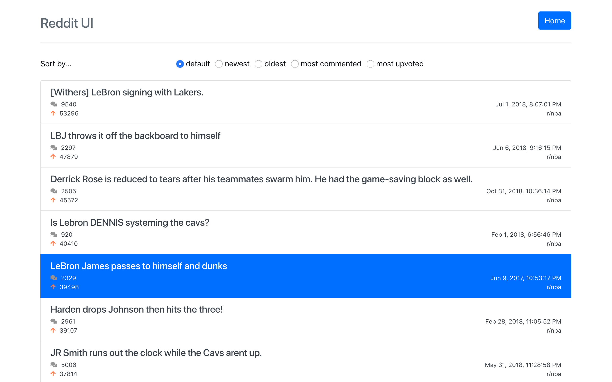

# Angular Reddit

This is a fun little project in which I play around with the Reddit API.

## Running

First, make sure you have Angular 6 installed. Then clone the repository and run `ng serve` to start up the application. Then visit [localhost:4200](https://localhost:4200).

You will be presented with a form asking which subreddit(s) you'd like to query against, and the type/timespan of posts you'd like to get as results.

     
    
      
    

